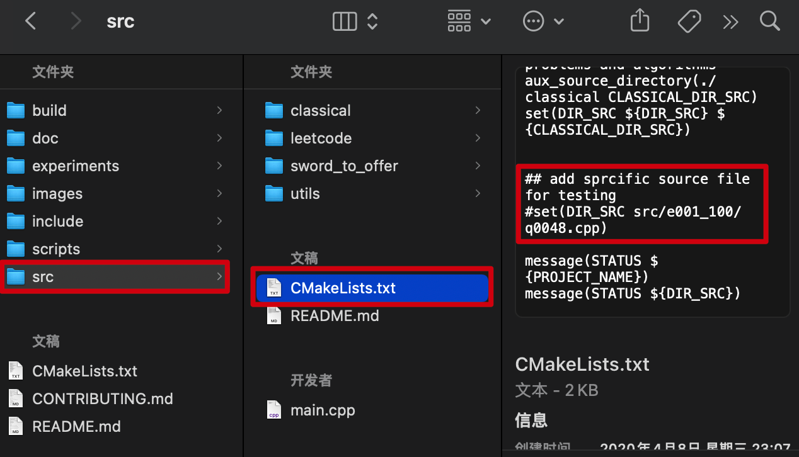

# leetcode

Collect leetcode-like problems and solutions dedicated to improving algorithm design.

【译】收集leetcode类型的问题和解决方案，致力于提高算法设计的能力。

***对本项目感兴趣的朋友，麻烦加个star以示鼓励。***

仓库收录的所有问题，请查看：[收录列表](src/README.md)

## Articles 文章

[博客>>>](https://blog.bluegeek.me/archive/?tag=%E9%9D%A2%E8%AF%95%E5%88%B7%E9%A2%98)

## 1. Records 记录

[Leetcode](src/leetcode/)

[剑指Offer](src/sword_to_offer/)

[经典问题和算法](src/classical/)

## 2. Dependencies 依赖

* cmake
* gflags
* glog
* gtest

## 3. Compile 编译

### (1). 操作系统

目前的编译配置支持的操作系统为：***MacOS和Ubuntu***，其他操作系统下可能需要自行稍作修改。

### (2). 安装依赖

MacOS：

参考 `.github/workflows/main.yml`文件中的`build`任务中的`Installation depends`步骤即可

Ubuntu：

参考 `.github/workflows/main.yml`文件中的`build_on_ubuntu`任务中的`Installation depends`步骤即可

### (3). 指令

安装完成编译依赖之后，直接运行 `release.sh`脚本即可在 `build`目录下生成`leetcode`可执行文件。

```bash
bash release.sh
```

运行所有测试用例：

```bash
./build/leetcode
```

### (4). 调试

[VSCode 调试配置说明](doc/vscode-config.md)

## 4. Join 参与

欢迎正在使用leetcode的朋友提交Pull Request贡献代码，相关规范，请查看：[贡献说明](CONTRIBUTING.md)

### F&Q

#### 1. [为什么要学会Git？](https://mp.weixin.qq.com/s/GH6ka8zI2sqYQGmZyA-oKQ)

#### 2. [如何在Github上提交 Pull Request ？](https://mp.weixin.qq.com/s/4MH6edEc1TXieEUwwXj1Iw)

#### 3. 怎样只调试和运行一个解决方案？

工程本身是会一次编译所有解决方案的，因此会在增加新解决方案时造成调试上的麻烦。
对于这种情况，可以通过设置 `src/CMakeLists.txt` 文件中的一个变量 `DIR_SRC` 解决，具体如下图



注意一定要在注释提示的位置修改，不然还是会把其他源码文件加载进来。


## 5. Communicate 交流

关于“Leetcode面试刷题”或者“计算机编程”相关的讨论可以提交ISSUE
